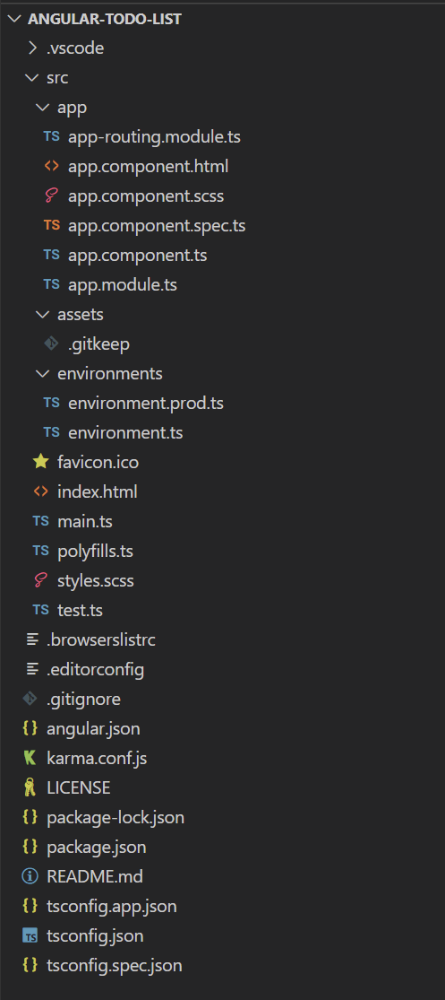
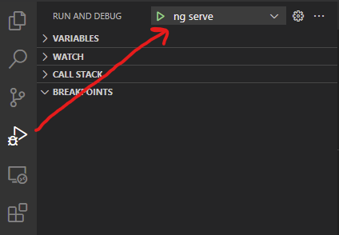

# Angular CLI Workshop Exercise 1 - Generating a new application

In this exercise, we will generate a new project and explore everything that the Angular CLI gives us to start with. It takes care of a lot of boilerplate setup so that you can dive right into working on the important parts of your app and not get bogged down in setup and configuration.

## Generate the application

Run the following command in your terminal. Make sure you run it in the root directory for this project.

  ```
  ng new angular-todo-list --directory ./ --style scss --routing true
  ```

A couple of notes:

* You would typically start out a new project without already having an existing folder for it like we do here. In that case you could run just `ng new [app-name]` in the desired parent directory. Angular would create the directory for the project and put all of the project files in there. In our case, `--directory ./` tells the Angular CLI to put the files in the directory where the command was run because we don't want it generated in a nested directory.
* We have included `--style scss --routing true` to answer a couple of questions that we would have otherwise been prompted to answer. This is to ensure no one accidentally chooses a different option for the workshop.
* To see all available options for the `new` command, you can find them in [the documentation](https://angular.io/cli/new)

## Run the application

The `ng new` command has generated a fully-functional single-page applicaiton for us, rady to be customized to our needs. For now, let's run it and see what it's given us. In your terminal, run:

```
ng serve
```

the output should look something like

```
✔ Browser application bundle generation complete.

Initial Chunk Files   | Names         |  Raw Size
vendor.js             | vendor        |   2.11 MB |
polyfills.js          | polyfills     | 318.06 kB |
styles.css, styles.js | styles        | 210.56 kB |
main.js               | main          |  50.18 kB |
runtime.js            | runtime       |   6.52 kB |

                      | Initial Total |   2.68 MB

Build at: 2023-01-31T21:27:17.608Z - Hash: b27fe04d93b98a2c - Time: 16846ms

** Angular Live Development Server is listening on localhost:4200, open your browser on http://localhost:4200/ **
```

Open http://localhost:4200/ in your browser as the output suggests.

You should see a smple page with some links to Angular documentation and some buttons to show some example CLI commands.

When you're done looking at this page, you can close the browser window/tab and then cancel the `ng serve` command by pressing `ctrl-c` in your terminal if you're on Windows, or `cmd-c` if you're on OSX.

## Build the project


## Execute tests

The Angular CLI has also helpfully set us up with a testing framework. To run the tests, execute `ng test` in your terminal. After a moment, a browser window will open and you should see output similar to this in your terminal:

```
✔ Browser application bundle generation complete.
01 02 2023 10:48:41.484:WARN [karma]: No captured browser, open http://localhost:9876/
01 02 2023 10:48:41.550:INFO [karma-server]: Karma v6.4.1 server started at http://localhost:9876/
01 02 2023 10:48:41.551:INFO [launcher]: Launching browsers Chrome with concurrency unlimited
01 02 2023 10:48:41.558:INFO [launcher]: Starting browser Chrome
01 02 2023 10:48:42.159:INFO [Chrome 109.0.0.0 (Windows 10)]: Connected on socket c6bdJUvDlzhTog_7AAAB with id 92645543
Chrome 109.0.0.0 (Windows 10): Executed 3 of 3 SUCCESS (0.106 secs / 0.077 secs)
TOTAL: 3 SUCCESS
```

More detail is shown in the browser window as well.

Note that the terminal command doesn't complete. While this is running, you can modify both your source files or your specs (tests) and the tests will automatically rerun on save. You can cancel the tests by pressing `ctrl-c` or `cmd-c` in your terminal. The browser window will close automatically. 

You can also generate a code coverage report by running the command with the `--code-coverage` option. This will generate an HTML report inside a `coverage` folder at the root of the project. You may try this if you wish.

Additional options for testing are described in the [documentation](https://angular.io/cli/test).

## Examine the application structure

Now that we've seen the output of our starting point, lets take a look at the structure of the directories and files it created for us so we know what we can change from here.

In VSCode, make sure you're on the Explorer tab (the top button on the far-left that looks like stacked papers). Expand all of the folders under the projet name (Will be the name of the directory that you checked out the project to). You should see something like this.

<p style="text-align:center">
    
</p>

Lets start with the files in the root of the project and work our way down from there. 

### Dependency management

This project uses [NPM](https://docs.npmjs.com/about-npm) for dependency management. As such, you will see two related files, `package.json` and `package-lock.json`, and one directory `node_modules`. If you are familiar with NPM already, you can skip the following bullets.

* `package.json` is where the packages that your project depends on are declared. There's a section called `dependencies` for things that are required for the project to run in the browser, and there's a section called `devDependencies` for things that are needed for development or building the project. At the top is a section titled `scripts`. This is where you can declare shortcuts to run commonly-used commands. They can be run in the terminal by executing `npm run [name of script]`. We won't be using them ecept for possibly the `watch` script.
* `package-lock.json` stores the eact versions of all dependencies that were installed the last time `npm install` was run. `npm install` was run automatically for you as part of the `ng new` command you ran earlier, which is why this file exists. You should never manually edit this file. It is to maintain consistency in the build when building in a `CI/CD` environment, or between multiple developers working on the same project.
* `node_modules` is the directory where all of the dependencies are stored. It can become very large. It is not committed to the repository and should already be ignored (In VS Code, you can tell a file is ignored from the repository because it is colored gray in the Explorer sidebar). You should not have to interact with the contents of this folder directly.

Adding new dependencies is outside the scope of this workshop, so we will not go over the steps to do so.

### Build configuration

Angular handles the entire process of taking your Typescript, HTML, and SCSS files and building them into an application. The configuration for how this is done is held in the following files

* `tsconfig.json` holds the primary configuration for the Typescript compiler and dictates how your typescript files are converted into javascript files for browsers to consume.
* `tsconfig.app.json` and `tsconfig.spec.json` both extend the primary `tsconfig.json` file to specify which files to compile and where the output should be emitted. One is for the main application and the other is for your specs (tests).
* `angular.json` is the configuration file that specifies how the Angular CLI should build, test, lint, or serve your application. This file is fairly complex. Take a quick review of it and notice where other files are referenced. A full explanation of this file is out of scope, but you can read the [documentation](https://angular.io/guide/workspace-config) if you're interested in the details.

### Test configuration

Tests are configured to run though the Jasmine Spec Runner via Karma. this configuration is stored in the `karma.conf.js` file. This file is referenced from the test architect inside the `angular.json` file, where it also points to `src/test.ts` for which test files to run. By default, all files matching `*.spec.ts` are run. You do not need to modify any of these as part of this workshop.

### Additional files

There are a few other configuration files provided which control various aspects of the application

* `.vscode` is a directory with a few files in it that configure behavior of VS Code. One to note is `launch.json` which provides shortcuts to a couple of the Angular CLI commands in the `Run and Debug` view of VS Code

    

* `.browserslistrc` defines which browsers you would like to support. By choosing to maintain only newer browsers, you can ensure that your generated application files remain smaller so your application can be more performant.
* `.editorconfig` defines a standard formatting style for files. No more things like mixed spaces and tabs or single and double quotes! This requires the [EditorConfig for VS Code](https://marketplace.visualstudio.com/items?itemName=EditorConfig.EditorConfig) extension to be installed in order for the rules to be applied in VS Code.
* `.gitignore` lists all the files and directories that should not be committed to the repository. Some helpful defaults have been pre-populated.
* `README.md` provides a starting point describing the applicaiton and some helpful CLI commands. Customize this as necessary for your application.

### Application source files

Now that we've looked at all of the configuration that's been put in place, we finally get to the core of the application (and a *tiny* bit more configuration) inside the `/src` directory. 

* `favicon.ico` is the icon to display in the browser tab and shortcuts. 
* `index.html` is the main entrypoint for the web application. During the build process, links to the compiled JavaScript and style sheets will be added before it is copied to the output directory.
* `main.ts` is the primary entrypoint for your TypeScript code. You should not need to modify this in most projects.
* `polyfills.ts` contains references to any polyfills that your application may need to run. Unless you need to support very old browsers, you shouldn't need to modify this.
* `styles.scss` contains global styles that are loaded on initial page load. Sometimes component styles, which only apply to the component they are defined in, are not enough. This is a good place to bring in frameworks like Bootstrap or Rivet that will be used very frequently.
* `tests.ts` was described above in the test configuration section. You shouldn't need to modify this, but we have found it can be helpful to run only one test file at a time once there gets to be very many of them.
* `environments` is a directory that contains two configuration files, `environment[.prod].ts`. These provide configuration that can be used in your code. The configuration that is chosen depends on whether you are doing a development or production build. You can see where this is configured in the `fileReplacements` section of the production configuration in `angular.json`.
* `assets` is a directory where you can place any resources that you want to be directly copied to the output. This is a good place for static images, font files, etc. The `.gitkeep` file inside causes the folder to be committed to the repository even if it is empty.

And finally, this brings us to the `/src/app` directory! This is where we'll be doing the bulk of our work. This is where all the source code for the application lives. To get us started, the Angular CLI has given us two modules and a component. A module groups together a set of related components and other modules into a logical unit. They specify any dependencies on other modules, declare components, provide services, and more. Don't worry about understanding all of those concepts just yet.

Let's look at the `app.module.ts` file first because that's where our application is bootstrapped.  

```typescript
// import dependencies from node_modules
import { NgModule } from '@angular/core';
import { BrowserModule } from '@angular/platform-browser';

// import objects from other source files
import { AppRoutingModule } from './app-routing.module';
import { AppComponent } from './app.component';

// Angular relies heavily on Typescript decorators (https://www.typescriptlang.org/docs/handbook/decorators.html) to notate modules, components, services, and more. The @NgModule decorator indicates that this class is a module.
@NgModule({
  // Declares the AppComponent in this module. A component can only be delcared in one module. The compiler will complain otherwise. If a component is needed in another module, that module can import the one it is declared in (bringing in all its dependencies as well).
  declarations: [
    AppComponent
  ],

  // Defines the dependencies of this module, the objcts it declares, and its providers.
  imports: [
    BrowserModule, // This application will run in a browser, so this brings in the infrastructure for that. Angular can also be configured for server-side rendering, but that's outside the scope of this workshop.
    AppRoutingModule // Brings in the routing module declared in app-routing.module.ts. We'll look at that next.
  ],
  providers: [], // We have no global providers (services). We will create one later in the workshop.
  bootstrap: [AppComponent] // Tell Angular that AppComponent is the entry-point to our Angular application. You should only have one bootstrap declaration in your application.
})
export class AppModule { } // Modules are classes. It is possible to put behavior in the class, but for the vast majority of cases they will remain empty.
```

And now for the `app-routing.module.ts` file. This is conventionally declared as a separate module, even though its contents could have been directly included in the `app.module.ts` file. As your project grows, you may have many routes, and so separating this out into it's own file increases maintainability.

```typescript
import { NgModule } from '@angular/core';
import { RouterModule, Routes } from '@angular/router';

const routes: Routes = []; // this array will define your routes, or pages, in your application. For now it is empty. We will add to it later.

@NgModule({
  imports: [RouterModule.forRoot(routes)], // Bring in the Angular RouterModule as a dependency and tell it that the routes defined above are our root routes. There are also child routes for nested routing, but again, that's outside our scope.
  exports: [RouterModule] // Eport the RouterModule so that it is brought into any module that imports this module
})
export class AppRoutingModule { }

```

More detailed information about modules can be found in the [documentation](https://angular.io/guide/architecture-modules).

Finally we arrive at our AppComponent. Components are generally composed of four files: a TypeScript file to declare the component and provide its behavior and logic, an HTML file for the markup, a SCSS file for styles, and a spec file for tests. We will look at the Typescript file in detail. Take a look at the HTML and SCSS files on your own as they are pretty self-explanatory. We're going to disregard the spec for now, but have a look if you're interested.

```typescript
import { Component } from '@angular/core';

// the @Component decorator indicates that this class represents a component and allows us to provide required configuration.
@Component({
  selector: 'app-root', // declares the HTML element that will construct an instance of this component. You can see where it's referenced in index.html inside the body tag
  templateUrl: './app.component.html', // Tells angular where to find the markup for this component
  styleUrls: ['./app.component.scss'] // Tells angular where to find the styles for this component
})
export class AppComponent {
    // inside the component, you are free to provide whatever variables, functions, etc that you like. Anything that is marked public is accessible on the template.

    // this is a public class variable. You can see it is referenced in the template to display the app name.
    title = 'angular-todo-list';
}
```

> **A note on naming conventions**: Angular has a set of [naming conventions](https://angular.io/guide/styleguide#symbols-and-file-names) that the CLI uses when creating new source files. It is recommended that you follow the same conventions when manually creating files yourself. For this workshop, we will be utilizing the CLI as much as possible, so this shouldn't be much of a concern.

## Conclusion

Phew! That's everything to get an Angular single-page app up and running. Aren't you glad the CLI did all that work for you? And not only do we have an app, but we have a test suite set up as well. We are now ready to start writing custom code in the next exercise.