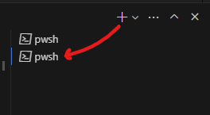

# Angular CLI Workshop Exercise 2 - Components

Now that we have all of the application setup out of the way, we can start the real work of creating our application. Because this workshop is about the Angular CLI and not learning Angular itself, there will not be much formal explanation of how the code functions. However, feel free to ask questions as time permits.

## Create the initial todo list application

As a starting point, lets create a basic todo list application on a single "page" without using any components, as you might be tempted to do in a traditional development style.

Replace the contents of the following files with the provided content.

`app.component.html`
```html
<h1>Todo List</h1>

<hr />

<div class="add-item">
  <input [(ngModel)]="itemToAdd" placeholder="Something new to do">
  <button type="button" (click)="add()">Add</button>
</div>

<h2>Items to do</h2>
<div class="todo" *ngFor="let todo of thingsStillToDo">
  <span>
    {{todo.actionDate | date : 'medium'}} - <strong>{{todo.task}}</strong>
  </span>
  <button type="button" (click)="todo.complete()">Complete</button>
</div>
<div *ngIf="thingsStillToDo.length ===0">Nothing to do!!</div>

<h2>Completed Items</h2>
<div class="todo" *ngFor="let todo of thingsDone">
  <span>
    {{todo.actionDate | date : 'medium'}} - <strong>{{todo.task}}</strong>
  </span>
</div>
<div *ngIf="thingsDone.length ===0">Get to work!</div>
```

`app.component.scss`
```scss
:host {
  display  : block;
  max-width: 720px;
  margin   : auto;
}

.add-item {
  display        : flex;
  justify-content: flex-end;

  button {
    margin-left: 10px;
  }
}

.todo {
  display        : flex;
  justify-content: space-between;
  align-items    : center;

  +.todo {
    margin-top : 10px;
    padding-top: 10px;
    border-top : 1px solid gray;
  }
}
```

`app.component.ts`
```typescript
import { Component } from '@angular/core';

class TodoItem {
  public createdOn: Date = new Date();
  public completedOn: Date | null = null;

  constructor(public task: string) { }

  public get actionDate(): Date {
    return this.completedOn ?? this.createdOn;
  }

  public get isComplete(): boolean {
    return !!this.completedOn;
  }

  public complete() {
    this.completedOn = new Date();
  }
}

@Component({
  selector: 'app-root',
  templateUrl: './app.component.html',
  styleUrls: ['./app.component.scss']
})
export class AppComponent {

  public itemToAdd: string = '';

  private todos: TodoItem[] = [
    new TodoItem('Learn about Angular'),
    new TodoItem('Use the CLI'),
    new TodoItem('Profit!')
  ]

  public get thingsStillToDo(): TodoItem[] {
    return this.todos.filter(todo => !todo.isComplete);
  }

  public get thingsDone(): TodoItem[] {
    return this.todos.filter(todo => todo.isComplete);
  }

  public add() {
    if (this.itemToAdd) {
      this.todos.push(new TodoItem(this.itemToAdd));
      this.itemToAdd = '';
    }
  }
}
```

`app.module.ts`
```typescript
import { NgModule } from '@angular/core';
import { FormsModule } from '@angular/forms';
import { BrowserModule } from '@angular/platform-browser';

import { AppRoutingModule } from './app-routing.module';
import { AppComponent } from './app.component';

@NgModule({
  declarations: [
    AppComponent
  ],
  imports: [
    BrowserModule,
    FormsModule,
    AppRoutingModule
  ],
  providers: [],
  bootstrap: [AppComponent]
})
export class AppModule { }
```

Run `ng serve` in the terminal or use the launch configuration shortcut in VS Code.

Open your browser to http://localhost:4200/ and you should see a functional, albeit minimal, todo list application. Feel free to play around with it a bit and see how it works.  When you're done, leave the browser window open and the `ng serve` command running if you want.

## Determine areas for improvement

Looking at the code, there are a handful of areas where it can be cleaned up: remove redundancies, improve separation of concerns, etc. Some examples:

* Redundant markup for the two lists of items
* Redundant markup for the items in the lists
* AppComponent is managing more state than necessary
* More than one class defined in app.component.ts

This is a very simple and contrived example, but it illustrates the power of components to simplify complex code and state management.

## A short detour

Before we start extracting components, there is one setting change to make in the `angular.json` file that will simplify things for us later on. Browsers render custom elements as `display: inline` by default. More often than not, we would like them to be `display: block`. Let's make sure that when the CLI generates components for us, that it adds a bit of CSS to make that happen.

In `angular.json`, modify the following section near the top of the file
```json
"@schematics/angular:component": {
  "style": "scss"
}
```
to look like
```json
"@schematics/angular:component": {
  "style": "scss",
  "displayBlock": true
}
```

Now every time we generate a component, it's scss file will have this:
```scss
:host {
  display: block;
}
```

## Extract components

Lets break apart this monolithic component (since AppComponent is a component already) into smaller, more digestable pieces.

If you still have the `ng serve` command running from earlier, your terminal is currently occupied. Open a new terminal window to run the following CLI commands, or in VS Code, you can click the + icon at the top-right of the current terminal view to open another one. A list of your current terminals should display.



### Extract model class
The first thing to do isn't realted to components at all, but is more of a best practice. We should extract the `TodoItem` class out into it's own file.

Run
```
ng generate class todo-item --type=model --skip-tests
```

You should see a new file created called `todo-item.model.ts`. Move the contents of that class from `app.component.ts` to the new file. You also need to export the class to make it available elsewhere. It should look like this:

```typescript
export class TodoItem {
  public createdOn: Date = new Date();
  public completedOn: Date | null = null;

  constructor(public task: string) { }

  public get actionDate(): Date {
    return this.completedOn ?? this.createdOn;
  }

  public get isComplete(): boolean {
    return !!this.completedOn;
  }

  public complete() {
    this.completedOn = new Date();
  }
}
```

VS Code should now show compilation errors in `app.component.ts`. Your build in your other terminal window should be failing and there will be a message in your browser. To fix the build, we need to tell the `app.component.ts` file where the `TodoItem` class went by importing it.

An easy way to add missing imports in VS Code is to hover your cursor over the squiggly underline, click `Quick Fix...` (or place your cursor there and press `ctrl+.`), and then select `Add import from "./todo-item.model"` or `Add all missing imports`.

If you aren't using VS Code (why aren't you?), add this line to the imports at the top of the file:
```typescript
import { TodoItem } from './todo-item.model';
```

`app.component.ts` should look like this
```typescript
import { Component } from '@angular/core';
import { TodoItem } from './todo-item.model';

@Component({
  selector: 'app-root',
  templateUrl: './app.component.html',
  styleUrls: ['./app.component.scss']
})
export class AppComponent {

  public itemToAdd: string = '';

  private todos: TodoItem[] = [
    new TodoItem('Learn about Angular'),
    new TodoItem('Use the CLI'),
    new TodoItem('Profit!')
  ]

  public get thingsStillToDo(): TodoItem[] {
    return this.todos.filter(todo => !todo.isComplete);
  }

  public get thingsDone(): TodoItem[] {
    return this.todos.filter(todo => todo.isComplete);
  }

  public add() {
    if (this.itemToAdd) {
      this.todos.push(new TodoItem(this.itemToAdd));
      this.itemToAdd = '';
    }
  }
}
```

Better already!

### Extract todo item component

If you take a look at the `app.component.html` file, you will notice some redundant markup that displays the individual items. The two lists:

```html
<div class="todo" *ngFor="let todo of thingsStillToDo">
  <span>
    {{todo.actionDate | date : 'medium'}} - <strong>{{todo.task}}</strong>
  </span>
  <button type="button" (click)="todo.complete()">Complete</button>
</div>
```
and
```html
<div class="todo" *ngFor="let todo of thingsDone">
  <span>
    {{todo.actionDate | date : 'medium'}} - <strong>{{todo.task}}</strong>
  </span>
</div>
```

while not completely identical, are ideal candidates to be turned into components. Let's do that.

Run
```
ng generate component todo-list-item
```

The CLI creates a folder with the name of the component and all the files necessary to make a functional component. It also registers the component in the nearest module. In this case, it is added to the `declarations` section of the `AppModule` class in the `app.module.ts` file. Isn't that handy?

> Remember, a component cannot be used unless it is declared in a module (with one exception).

Let's test out what the CLI gave us. Look at the new `todo-list-item.component.ts` file. On line 4, you should see `selector: 'app-todo-list-item'` This tells us that the component will be rendered wherever we create a `<app-todo-list-item>` element.

Add this directly underneath the `<h2>Items to do</h2>` in `app.component.html`
```html
<app-todo-list-item></app-todo-list-item>
```

After you save the file, your browser should display `todo-list-item works!` underneath the `Items to do` header.

Now we can move all of the redundant markup from `app.component.html` into `todo-list-item.component.html`, but before we do that, look at this line:
```html
<div class="todo" *ngFor="let todo of thingsStillToDo">
```
see that `*ngFor`? That's what iterates and puts copies of that `<div>` on the page. We don't want that inside our component since our component represents only a single todo item. Move that `*ngFor` from the `<div>` to the `<app-todo-list-item>` so that we now have:

```html
<app-todo-list-item *ngFor="let todo of thingsStillToDo"></app-todo-list-item>
<div class="todo">
  ...
</div>
```

The build will fail now because the `todo` variable inside the `<div>` no longer exists in that scope. That's ok, because you can now move everything *inside* that `<div>` into `todo-list-item.component.html`, overwriting the content that's already there. You can now remove what's left of the `<div>`.

Repeat the similar process for the `Completed Items` list, but this time you don't need to move any more markup into `todo-list-item.component.html`.

This should leave you with:

`todo-list-item.component.html`
```html
<span>
  {{todo.actionDate | date : 'medium'}} - <strong>{{todo.task}}</strong>
</span>
<button type="button" (click)="todo.complete()">Complete</button>
```

`app.component.html`
```html
<h1>Todo List</h1>

<hr />

<div class="add-item">
  <input [(ngModel)]="itemToAdd" placeholder="Something new to do">
  <button type="button" (click)="add()">Add</button>
</div>

<h2>Items to do</h2>
<app-todo-list-item *ngFor="let todo of thingsStillToDo"></app-todo-list-item>
<div *ngIf="thingsStillToDo.length ===0">Nothing to do!!</div>

<h2>Completed Items</h2>
<app-todo-list-item *ngFor="let todo of thingsDone"></app-todo-list-item>
<div *ngIf="thingsDone.length ===0">Get to work!</div>
```

We now no longer have any reference to that `.todo` CSS class in this file. Those styles now belong in `todo-list-item.component.scss`. Move the block for that CSS class from `app.component.scss` to `todo-list-item.component.scss` so that you have

`app.component.scss`
```scss
:host {
  display  : block;
  max-width: 720px;
  margin   : auto;
}

.add-item {
  display        : flex;
  justify-content: flex-end;

  button {
    margin-left: 10px;
  }
}
```

`todo-list-item.component.scss` 
```scss
.todo {
  display        : flex;
  justify-content: space-between;
  align-items    : center;

  +.todo {
    margin-top : 10px;
    padding-top: 10px;
    border-top : 1px solid gray;
  }
}
```

After all these changes, you may have noticed that the application is no longer building. That's because we moved markup that references a `todo` variable into the template for our new `TodoListItem` component, and no `todo` variable exists within that component. Lets create one and pass the data in.

Above the constructor in `todo-list-item.component.ts`, add the following, making sure to add the necessary imports. (If you installed v15 of the CLI, there won't be any default constructor):
```typescript
  @Input()
  public todo!: TodoItem;
```

Back in `app.component.html`, lets pass in the iterator `todo` variable into our newly-created input on the component. Modify the `<app-todo-list-item>` elements to look like
```html
<app-todo-list-item *ngFor="let todo of thingsStillToDo" [todo]="todo"></app-todo-list-item>
...
<app-todo-list-item *ngFor="let todo of thingsDone" [todo]="todo"></app-todo-list-item>
```

After saving the files, the application should build correctly again. However, it doesn't look quite the same. We need to fix the SCSS that we moved.

> Because component styles are isolated to only modify the markup belonging to the component, we have to move the `.todo + .todo` sibling selector back to `app.component.scss`, even though that seems counterintuitive.

Modify the SCSS files to look like this:

`todo-list-item.component.scss`
```scss
:host {
  display        : flex;
  justify-content: space-between;
  align-items    : center;
}
```

`app.component.scss`
```scss
:host {
  display  : block;
  max-width: 720px;
  margin   : auto;
}

.add-item {
  display        : flex;
  justify-content: flex-end;

  button {
    margin-left: 10px;
  }
}

app-todo-list-item + app-todo-list-item {
  margin-top : 10px;
  padding-top: 10px;
  border-top : 1px solid gray;
}
```

Ahh. Much better. Back to the way we were. But wait... Something is still off. Do you see it? (check the browser)

When we made the `ListItemComponent` we copied the block of markup that had the `Complete` button and now the items in our completed list have a button to complete them... again? Let's fix that.

Add
```
*ngIf="!todo.isComplete"
```
to the button in `todo-list-item.component.ts` so that it looks like

```
<button type="button" (click)="todo.complete()" *ngIf="!todo.isComplete">Complete</button>
```

There we go! That was a bit of refactoring work, but look how much cleaner `app.component.html` is already!

### Extract todo list component

There's one more obvious component we can extract. This time we're not going to go through the refactoring step-by-step. Right now, `app.component.html` still has two similar blocks of markup that are nearly identical.

`app.component.html`
```html
<h2>Items to do</h2>
<app-todo-list-item *ngFor="let todo of thingsStillToDo" [todo]="todo"></app-todo-list-item>
<div *ngIf="thingsStillToDo.length === 0">Nothing to do!!</div>

<h2>Completed Items</h2>
<app-todo-list-item *ngFor="let todo of thingsDone" [todo]="todo"></app-todo-list-item>
<div *ngIf="thingsDone.length === 0">Get to work!</div>
```

 Lets make them into components.

 Run
 ```
ng generate component item-list
 ```

 Modify the new component files to match the following:
 
 `item-list.html`
 ```html
<h2>{{title}}</h2>
<app-todo-list-item *ngFor="let todo of items" [todo]="todo"></app-todo-list-item>
<div *ngIf="items.length === 0">{{emptyMessage}}</div>
 ```

`item-list.scss`
 ```scss
:host {
  display: block;
}

app-todo-list-item + app-todo-list-item {
  margin-top : 10px;
  padding-top: 10px;
  border-top : 1px solid gray;
}
 ```

 `item-list.ts`
 ```typescript
import { Component, Input } from '@angular/core';
import { TodoItem } from '../todo-item.model';

@Component({
  selector: 'app-item-list',
  templateUrl: './item-list.component.html',
  styleUrls: ['./item-list.component.scss']
})
export class ItemListComponent {

  @Input()
  public items!: TodoItem[];

  @Input()
  public title!: string;

  @Input()
  public emptyMessage!: string;
}
 ```

`app.component.html`
```html
<h1>Todo List</h1>

<hr />

<div class="add-item">
  <input [(ngModel)]="itemToAdd" placeholder="Something new to do">
  <button type="button" (click)="add()">Add</button>
</div>

<app-item-list [items]="thingsStillToDo" title="Items to do" emptyMessage="Nothing to do!!"></app-item-list>
<app-item-list [items]="thingsDone" title="Completed Items" emptyMessage="Get to work!"></app-item-list>
```

After saving, you should see that the application looks and functions like it did before our refactors. The difference is that the code is already much more manageable just by creating a couple components.

## Conclusion

In this exercise, we saw how easy it is to generate new custom components with the CLI command
```
ng generate component [component name]
```

If you don't like typing all that out, it can be shortened to
```
ng g c [component name]
```

We also learned how to generate a simple model class with
```
ng generate class [class name] --type=model 
```

Breaking your app down into bite-sized pieces that focus on only one thing will make your applications much easier to understand and make it less likely for bugs to be introduced. Generating the components via the CLI takes the tedium out of setting up the necessary boilerplate so you don't have a mental barrier about creating them. Because really, who want's to create those 4 files over and over again?

Next, we'll take a look at services and how they can help with state management.
