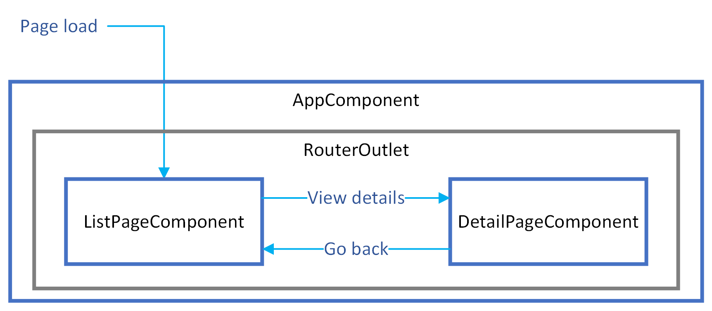

# Angular CLI Workshop Exercise 4 - Routing <span style="position: absolute; right:0; bottom: 8px; font-size: 1rem">(~20-30 minutes)</span>
(~15-20 minutes)

We're pretty limited with a web application that has only one "page". In this exercise, we'll add a route to a details page for an individual todo item. There we can display more detail, add more actions, or do anything else we want on a secondary page. This lays the foundation for creating complex applications with many pages.

The first thing we're going to do is yet another small refactor. This will set us up so that we have a component (`AppComponent`) that provides a common page header/footer, or any other scaffolding, for our child pages. 

Or final app flow will look something like this:

&nbsp;



&nbsp;

## Prepare for routing

When we generated the initial project with the CLI back in Exercise 1, the project that was created had routing already set up for us. We've just been ignoring it until now. At the start of Exercise 2, we deleted a line of code from `app.component.html` that we need to put back. 

Add
```
<router-outlet></router-outlet>
```

to the bottom of `app.component.html`. This is where the contents of the currently-displayed "page" (route) will be rendered.

## Create a route for the list page

We will start by extracting the display of the lists from the `AppComponent` and putting them into a new `ListPageComponent`.

Run
```console
ng g c list-page --skip-selector=true  
```

This is just a standard component like we created in exercise 2. The `--skip-selector` option tells the CLI to not define an element selector on the generated component. We don't need a selector because this component will never be used inside the template of another component. This is generally the case for all components that are used as routes.

Unfortunately, the CLI does not currently have an option to automatically update our route definitions when creating a component. We have to do that manually.

Update the route definitions in `app-routing.module.ts` with
```typescript
...
import { ListPageComponent } from './list-page/list-page.component';

const routes: Routes = [
  { path: '', component: ListPageComponent },
  { path: '**', redirectTo: '' }
];
...
```

This defines the `ListPageComponent` as the component that will be displayed when requesting the root of the application (`''`). The `**` path defines a route that matches anything that doesn't match anything else in the list of routes, and redirects back to the root. That way, if an invalid path is requested, you will see the `ListPageComponent` instead of nothing. Instead of a redirect, you could display a "PageNotFound" component here if you wanted.

If you aren't running `ng serve`, start it up and check your browser. You should see "list-page works!" at the bottom of the page.

## Move content into the list page

Move all of the content between the `<hr />` and `<router-outlet>` in `app.component.html` to `list-page.component.html`, replacing the content that is already there.

The final results should look like this:

`app.component.html`
```html
<h1>Todo List</h1>

<hr />
<router-outlet></router-outlet>
```

`list-page.component.html`
```html
<div class="add-item">
  <input [(ngModel)]="itemToAdd" placeholder="Something new to do">
  <button type="button" (click)="add()">Add</button>
</div>

<app-item-list [items]="todoService.thingsStillToDo" title="Items to do" emptyMessage="Nothing to do!!"></app-item-list>
<app-item-list [items]="todoService.thingsDone" title="Completed Items" emptyMessage="Get to work!"></app-item-list>
```

We also need to move the small amount of behavior between the TypeScript files. Modify the corresponding TypeScript files as follows.

`app.component.ts`
```typescript
import { Component } from '@angular/core';

@Component({
  selector: 'app-root',
  templateUrl: './app.component.html',
  styleUrls: ['./app.component.scss']
})
export class AppComponent {}
```

`list-page.component.ts`
```typescript
import { Component } from '@angular/core';
import { TodoService } from '../todo.service';

@Component({
  templateUrl: './list-page.component.html',
  styleUrls: ['./list-page.component.scss']
})
export class ListPageComponent {

  constructor(public todoService: TodoService) { }

  public itemToAdd: string = '';

  public add() {
    this.todoService.add(this.itemToAdd);
    this.itemToAdd = '';
  }
}
```

Finally, we need to move the styles. Move the `.add-item` class declaration from `AppComponent` to `ListPageComponent`.

`app.component.scss`
```scss
:host {
  display  : block;
  max-width: 720px;
  margin   : auto;
}
```

`list-page.component.scss`
```scss
:host {
  display: block;
}

.add-item {
  display        : flex;
  justify-content: flex-end;

  button {
    margin-left: 10px;
  }
}
```

If you don't see the changes reflected in your browser after saving, you may need to stop and restart `ng serve`. Sometimes more fundamental changes like adding/removing things from modules or routes aren't picked up properly.

The `AppComponent` has now been reduced to only managing things that are application-wide. In this case, it's just to provide a global header. For a larger project, this is convenient for adding application wide navigation, a footer, or anything else that you need applied to every page.

At this point, the application should look and behave exactly as it did before starting this exercise.

## Create a route for the detail page

This is where routing finally becomes useful for this application. We desire to have a more detailed view of our todo items with data and/or actions that might not be appropriate for the list view.

This time, we are going to create the component for this page a little differently. Angular has a concept of lazy-loaded routes, where the resources for a route, and all of its dependencies and child routes, are not loaded into the browser until you navigate to that route. The nice thing is that the CLI has a command to set this up automatically, and it even updates our routes for us. Note that lazy-loading such a small page is quite excessive for this simple application, but it demonstrates another feature of Angular and the CLI.

Run
```console
ng generate module detail-page --route=details --module=app-routing
```

You should see a new directory named `detail-page` with all the files for a `DetailPageComponent`. Something new you will notice are the files `detail-page.module.ts` and `detail-page-routing.module.ts`. The command we ran was to create a module and not just a component. Because we assigned it to a route (`details`), the CLI was helpful enough to create a component for us as well and set up the lazy-loading.

The route definitions in `app-routing.module.ts` should have been updated to look something like this:

```typescript
const routes: Routes = [
  { path: '', component: ListPageComponent },
  { path: 'details', loadChildren: () => import('./detail-page/detail-page.module').then(m => m.DetailPageModule) },
  { path: '**', redirectTo: '' }
];
```

Don't worry about the syntax for the new `details` route. Just know that that's Angular's way of lazy-loading resources for a route.

One thing we will need to update is the route for the new `DetailPageComponent` inside `detail-page-routing.module.ts`. We want a page for the details of a specific todo item, but how do we know which one? We have to be able to get the id of the todo item to be displayed. Update the path of the route from `''` to `':id'`. The result should look like:
```typescript
const routes: Routes = [{ path: ':id', component: DetailPageComponent }];
```

We now have a path with a special syntax.  When a path contains a segment that starts with `:`, that defines a path variable who's name follows the `:`. In this case, a request for `http://localhost:4200/details/123` will result in the `id` variable having the value `123`. We will see how to get access to that value later on in the exercise.

## Link to the detail page

In order to get to the detail page, we have to have a link that points to that route. You can't expect people to memorize the ids of their todo items, now can you? 

Change the `span` around the text in `TodoListItemComponent` to a link to the detail page:

`todo-list-item.component.html`
```html
<a [routerLink]="['details', todo.id]">
  {{(todo.completedOn ?? todo.createdOn) | date : 'medium'}} - <strong>{{todo.task}}</strong>
</a>
```

Here's where that new `id` field on the `TodoItem` interface becomes useful. We can't pass a reference to the object to a new route, but we can pass information to allow us to look it up.

Add some styling to make it minimally useful by appending some styles for the new anchor tag.

`todo-list-item.component.scss`
```scss
...

a {
  flex-grow: 1;
  padding  : 10px 0;

  &:hover {
    background-color: #e0e0e0;
  }
}
```

Now, when you click on one of the items in the lists, you are directed to a new "page" and you should see `detail-page works!` under the global header. Notice that the browser address bar has updated. The browser back/forward navigation buttons work as well.

## Upgrade the TodoService

In order to display the details of one item at a time, we need a way to retrieve a single todo item from the service. For that, we can add a simple method to pull an item out of the list by its id. We are also going to add a couple additional actions to the detail view: marking an item as incompleted and deleting an item. Add the following code to `todo.service.ts`

```typescript
...

public get(id: number): TodoItem | undefined {
  // This would typically be a call to the back-end to fetch the entity
  // For now, we'll just find the item in the array
  return this.todos.find(todo => todo.id === id);
}

public markIncomplete(todo: TodoItem) {
  // This would typically be a call to the back-end to update the entity and return the object with the updated date
  todo.completedOn = null;
}

public delete(item: TodoItem) {
  // This would typically be a call to the back-end to delete the entity
  const index = this.todos.indexOf(item);
  if (index > -1) {
    this.todos.splice(index, 1);
  }
}
```

## Complete the detail page

Since this workshop isn't about learning the details of Angular itself, code for a simple detail view is provided below. Copy the contents of these code blocks into their respective files.

`detail-page.component.html`
```html
<ng-container *ngIf="item">
  <h2>{{item.task}}</h2>
  <dl>
    <dt>Created on</dt>
    <dd>{{item.createdOn | date : 'medium'}}</dd>
    <dt>Completed on</dt>
    <dd>{{isComplete ? (item.completedOn | date : 'medium') : 'Incomplete'}}</dd>
  </dl>

  <button type="button" (click)="toggleComplete()">Mark {{isComplete ? 'inc' : 'c'}}omplete</button>
  <button type="button" (click)="delete()">Delete</button>
  <a routerLink="/">Back to list</a>
</ng-container>
```

`detail-page.component.ts`
```typescript
import { Component, OnInit } from '@angular/core';
import { ActivatedRoute, Router } from '@angular/router';
import { TodoItem } from '../todo-item.model';
import { TodoService } from '../todo.service';

@Component({
  templateUrl: './detail-page.component.html',
  styleUrls: ['./detail-page.component.scss']
})
export class DetailPageComponent implements OnInit {

  public item?: TodoItem;

  constructor(
    private route: ActivatedRoute,
    private router: Router,
    private todoService: TodoService
  ) { }

  ngOnInit(): void {
    // Here's where we extract the id variable from the route that we defined earlier in the exercise
    const id = Number(this.route.snapshot.params['id']);
    this.item = this.todoService.get(id);
  }

  public get isComplete(): boolean {
    return this.todoService.isComplete(this.item!);
  }

  public toggleComplete() {
    (this.isComplete ? this.todoService.markIncomplete : this.todoService.complete)(this.item!);
  }

  public delete() {
    if (confirm(`Are you sure you want to delete "${this.item!.task}"?`)) {
      this.todoService.delete(this.item!);
      this.router.navigate(['/']);
    }
  }
}
```

`detail-page.component.scss`
```scss
:host {
  display: block;
}

button {
  margin-right: 10px;
}
```

## Conclusion

In this exercise we explored how to route to multiple pages and share some data between them by defining path variables with the `:` syntax. This sets the foundation for moving from a true single-page application to one with multiple "pages" and URL paths to access them directly.

> **Note**: We could have used a query parameter for the DetailPageComponent route. Some may prefer that as their best practice. For this exercise, we chose to use a path variable. Feel free to explore using a query parameter instead.

There are no special CLI commands to define simple routes for you since it typically involves only generating a new component and modifying your routes to point at that component. However, you can define a set of lazy loaded routes by generating a new module for them with `ng generate module [module name] --route=[route name]` Lazy-loading is great when your application is large and potentially has many groups of related pages that might never be touched by most users. It allows you to avoid loading the code for every single page for every user.
